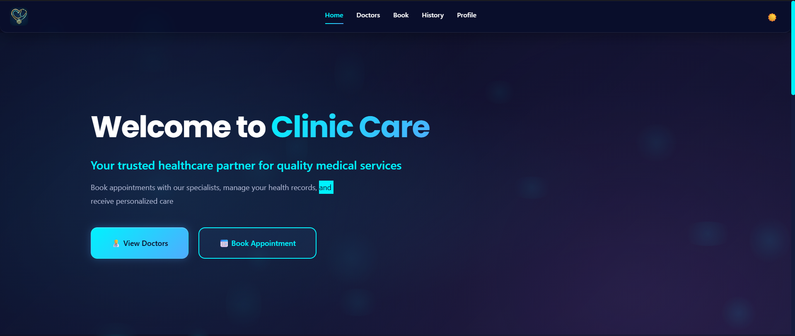
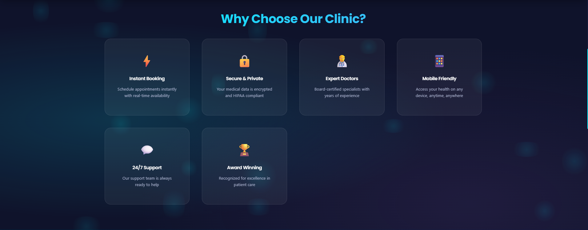
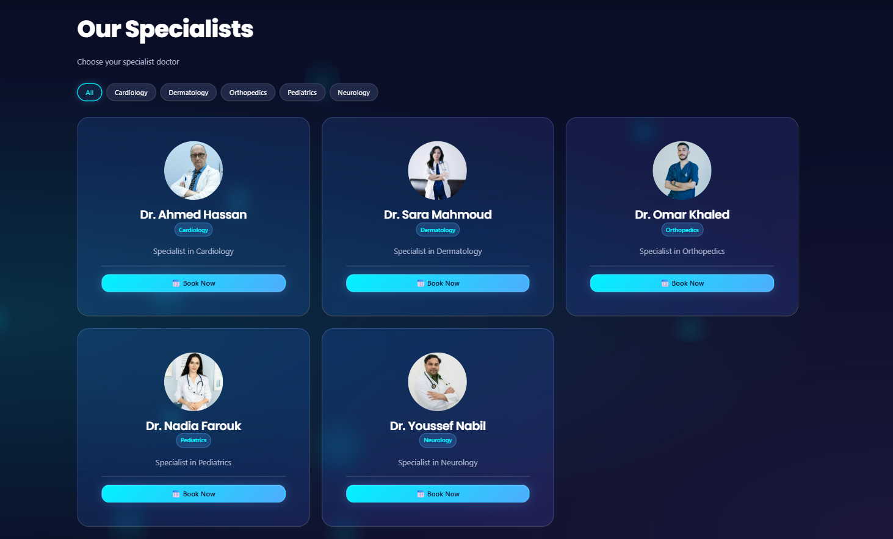
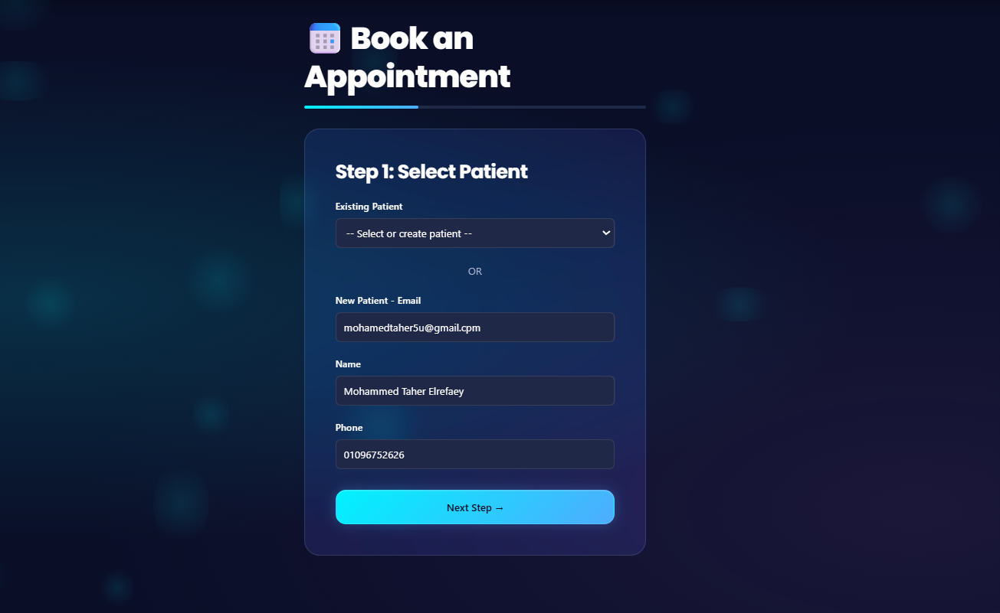
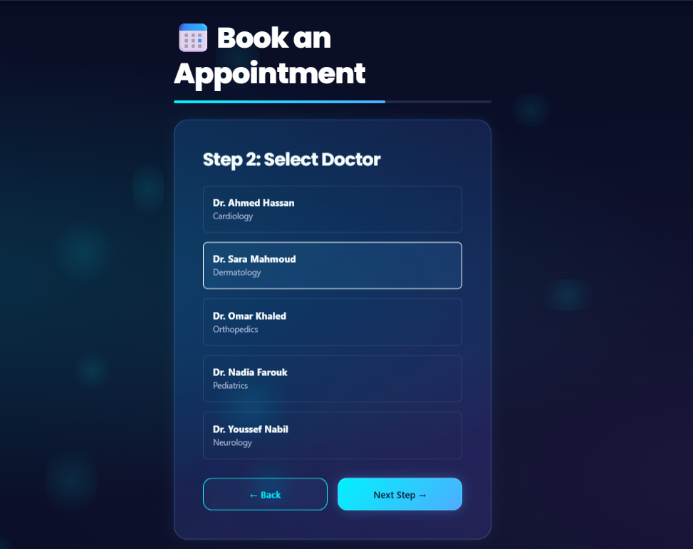
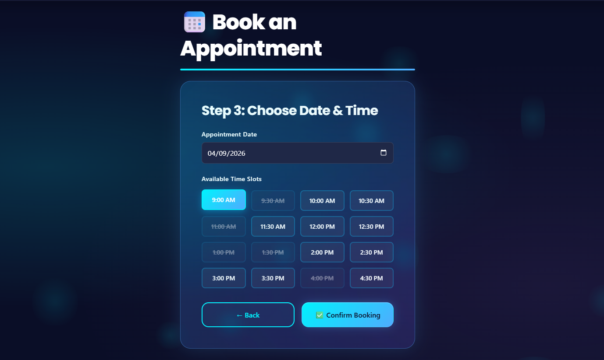
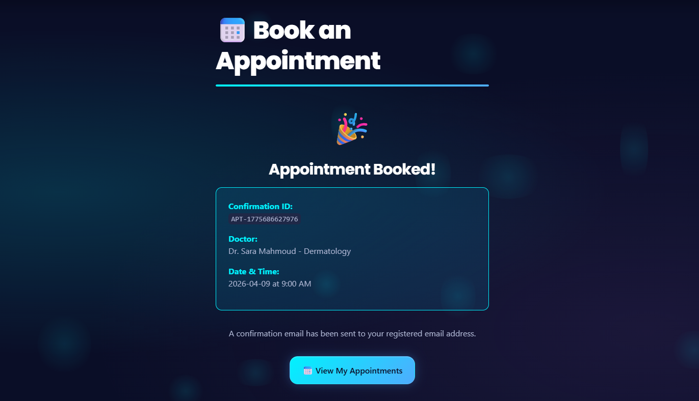

# 🏥 Clinic Appointment Management System

<div align="center">

**A Modern, Responsive & Production-Ready Healthcare Platform** *Designed for Excellence, Built for Performance*

[](#)
[](#)
[](#)
[](#)

</div>

---

## 👥 Project Team

* Mohamed Taher Elrefaey
* Karim Mohamed Zaky
* Ganna Amr Emad
* Mariam Mohamed Darwish
* Hanin Mahmoud Abdelfattah

---

## 📖 Table of Contents

1. [About the Project](#-about-the-project)
2. [Key Features](#-key-features)
3. [Screenshots](#-screenshots)
4. [Technical Stack](#-technical-stack)
5. [Getting Started](#-getting-started)
6. [Project Structure](#-project-structure)
7. [Future Roadmap](#-future-roadmap)

---

## 🎯 About the Project

**Clinic Care** is a high-performance web application designed to streamline the medical appointment booking process. It bridges the gap between patients and healthcare providers with a seamless, intuitive interface.

Built without heavy frameworks, this project demonstrates mastery of **Core Web Technologies**, focusing on raw performance, accessibility, and modern UI/UX principles.

### ✨ Why This Architecture?

* **🚀 Blazing Fast:** Zero framework overhead means instant load times.
* **💎 Modern UI:** Glassmorphism design system with smooth micro-interactions.
* **📱 Responsive:** Mobile-first approach ensuring perfect display on any device.
* **🛡️ Robust:** Comprehensive error handling and state management.

---

## 🚀 Key Features

* **📅 Multi-Step Booking Wizard:** A guided 3-step process (Patient ➡️ Doctor ➡️ Time) ensuring data accuracy.
* **🕒 Dynamic Time Slots:** Real-time availability simulation with visual indicators for booked slots.
* **🔍 Smart Filtering:** Instant search and specialization filtering for doctors.
* **🌓 Theme System:** Built-in Dark/Light mode with persistence.
* **💾 Local State:** Draft saving ensures users don't lose progress if they refresh.

---

## 📸 Screenshots

### 🏠 1. Home & Hero Section
Welcome screen with clear Call-to-Action buttons.


### ⭐ 2. Features & Benefits
Highlighting the core value propositions of the platform.


### 👨‍⚕️ 3. Doctor Specialists
Grid view of doctors with filtering capabilities and direct booking access.


### 📝 4. Booking: Select Patient
Step 1: Choose an existing patient or register a new one on the fly.


### 🩺 5. Booking: Select Doctor
Step 2: Choose the specialist based on the patient's needs.


### ⏰ 6. Booking: Date & Time
Step 3: Interactive calendar and time slot selection.


### ✅ 7. Confirmation
Success state with unique Appointment ID and summary details.


---

## 🛠️ Technical Stack

| Category | Technologies |
| :--- | :--- |
| **Core** | HTML5, CSS3, JavaScript (ES6+) |
| **UI/UX** | Glassmorphism, CSS Grid/Flexbox, CSS Variables |
| **Architecture** | Modular ES6 Imports, MVC Pattern |
| **Storage** | LocalStorage API (for Drafts & Settings) |
| **Performance** | Lazy Loading, DOM Caching, Event Delegation |

---

## 🚀 Getting Started

Follow these steps to get a local copy up and running.

### Prerequisites

* Modern Web Browser (Chrome, Edge, Firefox)
* Code Editor (VS Code recommended)

### Installation

**1. Clone the repository**
```bash
git clone [https://github.com/MohamedxTaher/my_clinic.git](https://github.com/MohamedxTaher/my_clinic.git)
cd clinic
2. Run the Application

Option A (VS Code): Open frontend/index.html and use the "Live Server" extension.

Option B (Python):

Bash
cd frontend
python -m http.server 8000
Option C (Direct): Just double-click frontend/index.html in your file explorer.

📂 Project Structure
Plaintext
clinic/
├── frontend/
│   ├── css/            # Modular Stylesheets
│   ├── js/             # Application Logic
│   │   ├── api/        # API Client & Services
│   │   ├── pages/      # Page Controllers
│   │   └── utils/      # Helpers & Validators
│   ├── images/         # Assets & Doctor Photos
│   └── index.html      # Entry Point
├── database/           # SQL Schema & Seeds
├── screenshots/        # Project Documentation Images
└── README.md           # Project Documentation
🗺️ Future Roadmap
Backend Integration: Connect with Spring Boot API.

Authentication: JWT-based Login/Register system.

Admin Dashboard: Analytics and doctor management panel.

Notifications: Email/SMS reminders for appointments.