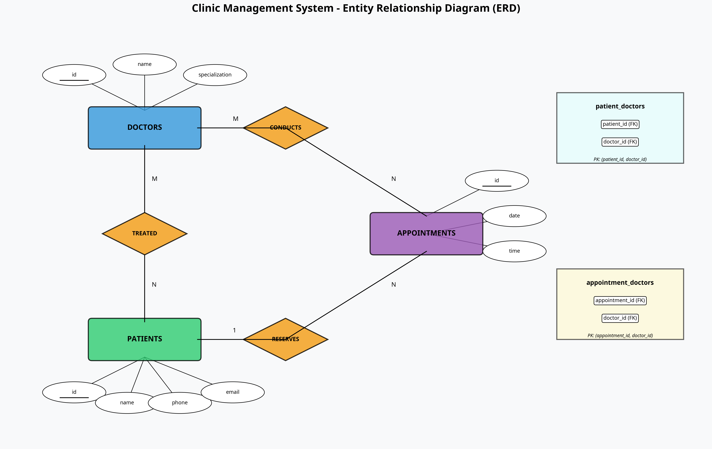

🗄️ Clinic Management System - Database Schema
📊 Entity Relationship Diagram

Figure 1: Complete ER Diagram showing all entities, relationships, and attributes

📋 Overview
This database schema is designed for a Clinic Appointment Management System. It follows Third Normal Form (3NF) to eliminate redundancy and ensure data integrity.

Key Design Principles:
✅ Normalization: All tables are in 3NF

✅ Referential Integrity: Foreign keys with CASCADE operations

✅ Data Validation: NOT NULL, UNIQUE constraints

✅ Scalability: Designed for future expansion

📚 Tables Documentation
1. Doctors Table
Stores information about medical specialists.

Column	Type	Constraints	Description
id	INT	PRIMARY KEY, IDENTITY	Unique doctor identifier
name	VARCHAR(100)	NOT NULL	Doctor's full name
specialization	VARCHAR(100)	NOT NULL	Medical specialty
Sample Data:

SQL
INSERT INTO doctors (name, specialization) VALUES
('Dr. Ahmed Hassan', 'Cardiology'),
('Dr. Sara Mahmoud', 'Dermatology'),
('Dr. Omar Khaled', 'Orthopedics');
2. Patients Table
Stores patient personal and contact information.

Column	Type	Constraints	Description
id	INT	PRIMARY KEY, IDENTITY	Unique patient identifier
name	VARCHAR(100)	NOT NULL	Patient's full name
phone	VARCHAR(20)	NOT NULL	Contact phone number
email	VARCHAR(100)	UNIQUE, NOT NULL	Email address (unique)
Constraints:

Email must be unique (no duplicate accounts)

3. Appointments Table
Stores appointment scheduling information.

Column	Type	Constraints	Description
id	INT	PRIMARY KEY, IDENTITY	Unique appointment identifier
date	DATE	NOT NULL	Appointment date
time	TIME	NOT NULL	Appointment time
Relationships:

One patient can have many appointments (1:N)

One appointment belongs to one patient only

4. patient_doctors (Junction Table)
Implements Many-to-Many relationship between Patients and Doctors.

Column	Type	Constraints	Description
patient_id	INT	PRIMARY KEY, FOREIGN KEY	References Patients(id)
doctor_id	INT	PRIMARY KEY, FOREIGN KEY	References Doctors(id)
Composite Primary Key: (patient_id, doctor_id)

Purpose:

Tracks which patients are treated by which doctors

Allows one patient to have multiple doctors

Allows one doctor to have multiple patients

Cascade Rules:

ON DELETE CASCADE: If a patient or doctor is deleted, their relationship is removed

5. appointment_doctors (Junction Table)
Implements Many-to-Many relationship between Appointments and Doctors.

Column	Type	Constraints	Description
appointment_id	INT	PRIMARY KEY, FOREIGN KEY	References Appointments(id)
doctor_id	INT	PRIMARY KEY, FOREIGN KEY	References Doctors(id)
Composite Primary Key: (appointment_id, doctor_id)

Purpose:

Allows multiple doctors to attend a single appointment (e.g., consultation)

Tracks which doctors are assigned to which appointments

Cascade Rules:

ON DELETE CASCADE: If appointment or doctor is deleted, assignment is removed

🔗 Relationships Explained
Relationship Diagram

Plaintext
Doctors ──────< patient_doctors >────── Patients
   │                                      │
   │                                      │
   └──────< appointment_doctors >───── Appointments
Cardinality:

Relationship	Type	Description
Doctors ⟷ Patients	Many-to-Many (M:N)	One doctor treats many patients; One patient sees many doctors
Patients → Appointments	One-to-Many (1:N)	One patient has many appointments
Doctors ⟷ Appointments	Many-to-Many (M:N)	One doctor conducts many appointments; One appointment can have multiple doctors
📝 SQL Schema File
The complete SQL schema is available in:

File: clinic_schema.sql

Database: SQL Server (T-SQL)

Compatibility: SQL Server 2016+

🚀 Setup Instructions
1. Create Database

SQL
CREATE DATABASE clinic_db;
USE clinic_db;
2. Run Schema

Bash
# Execute the schema file
sqlcmd -S localhost -U sa -P YourPassword -i clinic_schema.sql
3. Verify Tables

SQL
-- List all tables
SELECT TABLE_NAME 
FROM INFORMATION_SCHEMA.TABLES 
WHERE TABLE_TYPE = 'BASE TABLE';
🔍 Sample Queries
Find all patients treated by a specific doctor:

SQL
SELECT 
    a.id AS appointment_id,
    a.date,
    a.time,
    d.name AS doctor_name,
    d.specialization
FROM appointments a
JOIN appointment_doctors ad ON a.id = ad.appointment_id
JOIN doctors d ON ad.doctor_id = d.id
WHERE a.patient_id = 1
ORDER BY a.date, a.time;
📊 Database Statistics
Table	Sample Records	Purpose
Doctors	5	Medical specialists
Patients	5	Registered patients
Appointments	5	Scheduled appointments
patient_doctors	7	Patient-doctor relationships
appointment_doctors	6	Appointment-doctor assignments
🔐 Security Considerations
Patient Data: Email addresses are unique and should be validated

Cascade Deletes: Be careful when deleting doctors/patients as it affects related records

Appointment Integrity: Appointments should have proper date/time validation

📈 Future Enhancements
Potential schema improvements:

Add created_at and updated_at timestamps to all tables

Add status field to appointments (scheduled, confirmed, completed, cancelled)

Add indexes on frequently queried columns (email, specialization, date)

Add audit trail table for tracking changes
